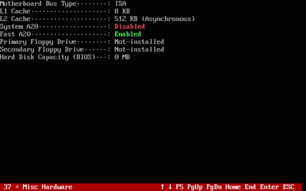
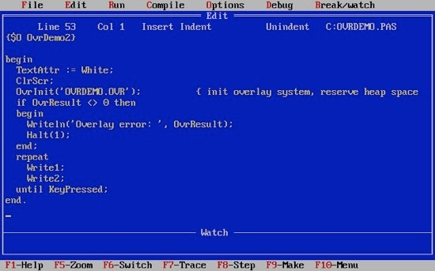

# Development: Programming languages etc.

-----

{: style="text-align:center"}
[Return to General Index](README.md)

-----

Please understand: I don't actually know all these languages. Where possible, I ran the included test suites or compiled some example code. If I could find documentation, I included it. But basically you are on your own here.

+ [Aida](./zip/aida.zip) v2.14-0202 - DOS System Information Tool.
    + A must-have system information tool
    + Detects lots of hard and soft wares, including all the latest (c. 2004) technology.
    + Gives you more than other infoprogs
    + *Update: This 16-bit program claims to detect a multitasking environment in bare FreeDOS and refuses to run. I am investigating.* 

+ [Agena](./zip/agena.zip) 2.12.4 - an interpreted procedural programming language.
    + Dual-licensed GPL v2 and MIT
    + A new easy-to-learn procedural programming language.
    + Suitable for scientific, mathematical, scripting, networking, and many other applications.
    + Binaries are [available](https://sourceforge.net/projects/agena/) for Solaris, Windows, Linux, OS/2, Mac OS X, Raspberry Pi and DOS.
    + Source included.
    + Under active development, so keep an eye out for updates.
+ [Alice](./zip/alice.zip) - an IDE for the Alice dialect of Pascal, with a runtime interpreter.
    + Freeware by Brad Templeton.
    + This package contains all the tutorials and manuals mentioned on the [website](https://www.templetons.com/brad/alice.html), a review of the Atari ST version, and a Russian translation of the website.
    + The package defaults to the "large" version of Alice, which can use 640K of memory. The "regular" version is still there if you need it, but really, how many people are now working on a 256K system?

+ **Borland** <u>Turbo Pascal 1.0 / 3.02 / 5.5</u>, <u>Turbo C++ 1.01</u>, and <u>Turbo C 2.01</u> - Available as freeware from the [Embarcadero Museum](http://edn.embarcadero.com/museum).
    + Sorry, the license does not allow me to repackage these programs.
    + You will need to register an account with Embarcadero and receive their advertising email forever to get these languages. Or you could try [10 Minute Mail](https://10minutemail.com/10MinuteMail/index.html) for a temporary email address.
    + All come with very nice IDEs. Turbo Pascal 5.5 pictured below.

+ [Flisp](./zip/flisp.zip) 1.0 - A LISP implementation for DOS.
    + GNU GPL v2 by Francesco Zamblera 
    + Requires a 32-bit extender (e.g. CWSDPMI.EXE). FreeDOS has that built in already.
    + See /FDOS/DEVEL/FLISP/flisp.txt for documentation.

+ [Modula-2](./zip/modula2.zip) 4.0 - FST (Fitted) Modula-2 Version 4.0
    + This is the final release of FST Modula-2. It is  no more  than  a re-packaged  release 3.5.
    + The software was not changed to reflect the new release number.
    + The  only  changes   in  this   package  are   in  the documentation; specifically, the software license  changed, as shareware registration is no longer available.
    + See \FDOS\DEVEL\MODULA2\DOC\M2DOC.TXT for documentation.

+ [Moonrock](./zip/moonrock.com) 0.5 - A BASIC-like language with several extensions.
    + Produces small and tight executables. 
    + 8086, 80186+ or 80386+ code.
    + DOS real mode or DPMI protected mode.
    + Includes compiler, ArrowSoft assembler, documentation and sample programs.
    + Freeware by Rowan Crowe.

+ [SNOBOL 4](./zip/snobol.zip) - A freeware implementation of the SNOBOL language by Gordon E Peterson II.

+ [VT Prolog](./zip/vtprolog.zip) - Very Tiny Prolog.
    + A  simple PROLOG interpreter provided to encourage experimentation with PROLOG.

+ [XLisp](./zip/xlisp.zip) 2.0 - An Object-oriented Lisp.
    + Free for noncommercial use.
    + XLISP is an experimental programming language combining some of the features of Common Lisp with an object-oriented extension capability.
    + It was implemented to allow experimentation with object-oriented programming on small computers.

-----

{: style="text-align:center"}
[Return to General Index](README.md)

-----
