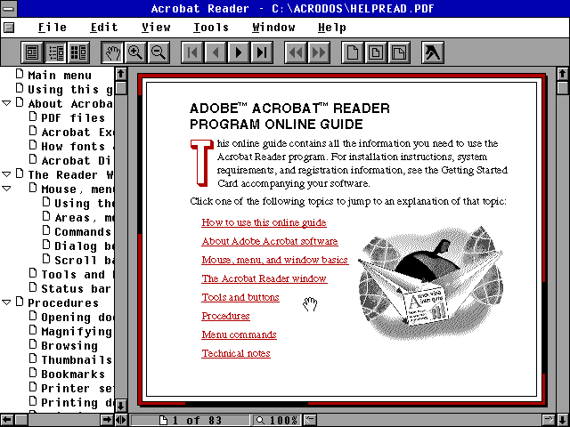
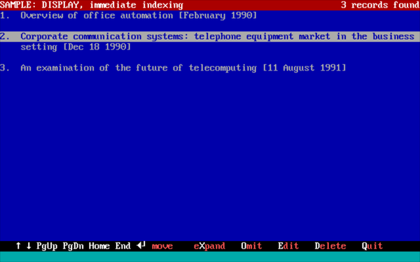
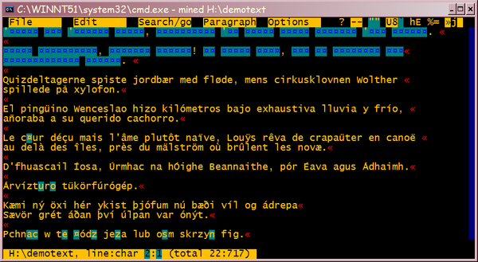

# Productivity applications

-----

{: style="text-align:center"}
For installation instructions, please [return to General Index](README.md)

-----

+ [Abbrev](./zip/abbrevv.zip) - A  menu-oriented DOS application to view and maintain a  list  of
abbrevations.
    + Freeware by J R Ferguson for non-commercial purposes.
    + Acronyms may be up to 7 characters long, the description can be any text up to 69 characters.
    + It shows one or more sorted abbrevation lists, allows you to insert, change or delete entries and search for duplicates. 
    + You can also merge two or more abbrevation lists into  a  single  one.
    + The  program  interface  is  quite
intuitive,   offering  mouse  support,  Windows-like menus  and  multiple document subwindows.
    + The program saves its last used settings in a file named ABBREVV.SET, so it can automatically open the same abbrevation file windows the next time you start it.


+ [Acrobat Reader](./zip/acrodos.zip) - The one and only time Adobe, Inc made a PDF viewer for DOS.
    + I have taken care of the installation for you and "registered" it to "FreeDOS User".
    + You can start the program with either *acrodos* or *acrobat*: the two batch files are identical.
    + If you have graphical problems, try *acrodosu* or *acrobatu*: these load the UNIVBE driver before running Acrobat itself. Makes no difference on *my* system, but it might help with really old display cards.
    + Acrobat for DOS can only display PDFs built to an early specification. But there are ways to convert a modern PDF to an older version: see [here](https://www.techwalla.com/articles/how-to-convert-pdf-files-to-an-older-format) and [here](https://itstillworks.com/save-pdf-older-version-adobe-6781219.html) for some ideas on the subject. Or you can use DOSPDF, which you will find in the [command line section](Commandline.md).
    + in *CONFIG.SYS*, your *FILES=* statement should be at least 20. The FreeDOS default is 40, so that should not be a problem.



+ [Ample Notice](./zip/an2.zip) 2.04 - An appointments calendar/alarm clock package that can help organize your life.
    + Shareware by Mark Harris.
    + You enter appointments and notes in any of a variety of natural formats.
    + You can specify that a birthday occurs each July 17, or that you have a meeting every other Tuesday at 4:00 for 5 meetings, or that Father's Day is the third Sunday in June.
    + Appointments which include a time can automatically set a 'pop-up alarm clock' which notifies you at a given advance interval.
    + Different categories of appointments can be tracked for preparation of group meetings or for summaries of specific activities.
    + The sorting and archiving options let you keep track of past activities for business purposes.  Searching for a given appointment (future or past) is fast and easy.
    + Ample Notice is easy to use right away, but is powerful enough to handle a variety of complex applications.
    + Also included is a program for addressing envelopes sideways from data on the screen or from a file.


+ [As-Easy-As](./imgs/aseasy.zip) 5.7 - Spreadsheet
    + In its day, this was THE shareware competitor to Lotus 1-2-3.
    + Now freeware courtesy of Trius, Inc.
    + Packaged as registered to "FreeDOS User" with serial number already filled in (but see the LSM file if you need it for some reason).
    + Also contains the manual in PDF format.


+ [Aurora](./zip/aurora.zip) - A popular and innovative shareware DOS text editor by Jeff Wunderlich and NText.
    + Aurora utilizes a multi-window, mouse-compatible text mode GUI.
    + Editing functions include column-mode text selection capability, unlimited undo/redo operations, and syntax highlighting.
    + Great macro facilities.
    + The DOS version handles files up to 1 GB in size.
    + Aurora also supports regular expression search/replace operations.
    + Aurora can double quite nicely as a word processor, but it lacks a spell checker.
    + Development of Aurora ceased around 1997.
    + The author has since permitted free registration of the program.
    + This package is preregistered to "FreeDOS User".


+ [Breeze](./zip/breeze.zip) by Kevin Solway - One of the most comprehensive text editors ever written for DOS.
    + Narrowly beats Aurora (above) in that it has a spell-checker. YMMV.
    + Ignore all the shareware documentation: according to the [website](http://www.theabsolute.net/sware/oldfav.html) this is now freeware.


+ [DataPerfect](./zip/datapfct.zip) 2.6 - A relational database.
    + DataPerfect, originally published by WordPerfect Corp, and later by Novell, was a fast, memory efficient, but capable relational database for DOS. 
    + WordPerfect Corp sold the product alongside their other DOS based office products, such as WordPerfect and PlanPerfect.
    + In 1995 Novell released DataPerfect as freeware and development was continued by its original author, Lew Bastian until about 2008.
    + **Packager's note:** I'll admit, I can't make head or tails of this program, but there are people who swear by it. You can get supporting programs and files [here](https://www.dataperfect.nl/files/).


+ [Freebase](./zip/freebase.zip) 1.2 - A free form flat-file database program.
    + Free form data entry using any ASCII text editor.
    + Rapid search and unlimited narrowing of the search records by subsequent searches using case insensitive search strings.
    + Ability to print search records.
    + Ability to write search records to a disk file.
    + Keywords to link records.


+ [InfoPal](./zip/infopal.zip) - Fast, small, and easy to use flat-file database.
    +  Great for phones, diaries, passwords, anything.
    + Mouse or keyboard
    + Context sensitive help
    + password protection
    + import, export
    + runs external programs
    + fast report generator
    + fast record finder
    + exceedingly customizable
    + includes ready-made databases
    + Freeware by  Hector Noriega 


+ [InMagic Plus](./zip/inmagic.zip) - Database Manager
    + Formerly Commercial software by InMagic Inc, now [Freeware](https://www.thefreelibrary.com/Inmagic+gives+away+DOS+products+as+freeware%3B+Challenges+Microsoft,...-a019160495).
    + InMagic Plus is designed to help you build, maintain, and use text databases.
    + Included with InMagic are all the tools you need to: define a database, load and retrieve information, create reports, keep your databases healthy, and more.
    + This was a serious product in its time: it sold for around $1000 and dominated the libraries market.



+ [Intermem Professional](./zip/impro.zip) - Schedule keeper / diary
    + Freeware by  Jeff Goke
    + INTERMEM Professional reminds you of upcoming events.
    + Also warnings may appear reminding you an event is scheduled to occur in x days.
    + If you wish to enter/edit an event type *IMPRO* at the DOS prompt to run INTERMEM.
    + IMPRO uses a DOS GUI Interface to make INTERMEM as easy to use as possible.
    + If you just wish to see what is coming up, type *IMPRO -a*.
    + In this FreeDOS package, if you want to put *IMPRO -a* in AUTOEXEC.BAT, use the CALL command, or nothing after it will be processed.
    + The first time you run INTERMEM -a it will complain about overdue appointments. Just click on "Done and Update". Then enter the main program and weed out the ones you don't want.


+ [Medit](./zip/medit.zip) 1.7.1 - A free, graphic, multi-window, cross-platform text editor.
    + Copyrighted but free-to-use software by Vincenzo Morello.
    + Multi window editing.
    + PullDown Menu with accelerator keys.
    + Cut & paste with the standard keystrokes: Ctrl+C, Ctrl+V, Ctrl+X and also Ctrl+Ins, Shift+Ins, Shift+Del.
    + Search forward/backward case sensitive/unsensitive, Replace.
    + Multi-level Undo/Redo.
    + Auto indent.
    + Source code supplied.
    + Anti-virus checksum at startup activated for DJGPP version.
    + Packager's note: This is one of the few graphical DOS apps that can use all of your modern non-4:3 screen without deformation. As supplied, it defaults to 800x600x256, but in \FDOS\LINKS\MEDIT.BAT on my Dell Latitude 2120, I have set it up for 1024x600x256 as follows:
````
    SET GRX20DRV=vesa gw 1024 gh 600 nc256 
````


+ <u>Microsoft Word</u> 5.5 - The last version for DOS of Microsoft's all-conquering word processor.
    + Released as freeware by Microsoft, Inc, supposedly as a Y2K update, but it contains the entire program.
    + Word for DOS 5.x is a dual mode MS-DOS and OS/2 application. It supports operation under 16-bit OS/2 1.x console mode.
    + Version 5.5 changes the user interface. It adds Mac/Windows features like pulldown menus and overlapping windows.
    + Packages include standalone format translators - Word<->DCA, RTF<->DCA, DOS<->Word, & more. 
    + The UK English version has the largest selection of printer drivers.
    + You can install all four if you like - they won't clash. Start the one you want with the command WORD55XX where XX is one of UK, US, DE or FR.
    + As delivered, this package has drivers for VGA and a Hewlett-Packard LaserJet printer.
    + To change these, go to the SETUP directory and run SETUP.EXE.
    + When you get to the point where it asks if you want to setup a new WORD or change an existing one, choose the second option and then in the next screen give the directory name as c:\FDOS\PROGS\WORD55XX where XX is one of UK, US, DE or FR.
    + You can also change the initial display mode (default: text-mode) in the same way.
    + Downloads:
        + [UK English](./zip/word55uk.zip)
        + [US English](./zip/word55us.zip)
        + [Deutsch](./zip/word55de.zip)
        + [Français](./zip/word55fr.zip)


+ [Mined](./zip/mined.zip) 2015.25 - A powerful text editor with a comprehensive and easy-to-use user interface and fast, small-footprint behaviour.
    + It is pronounced "min-ed" :-)
    + Can handle both Unicode and code pages.
    + GNU GPL v3



+ [PasswordBox](./zip/pbox.zip) - Keep all your passwords safe, inside an encrypted database.
    + GNU GPL v3 by Mateusz Viste.
    + CAUTION: This program features 128-bit AES encryption, which might be illegal in your country.
    + Run this program from the DOS prompt the first time, so that it can create its database. After that, you can run it from a launcher.

+ [PC-Calc](./zip/pccalc.zip) 2.0 - Spreadsheet.
    + Shareware by Jim Button.


+ [PC-File](./zip/pcfile.zip) 5.01 - Flat-file Database manager.
    + Freeware by Jim Button.
    + Uses the DBASE format - its DBF files can be read by LibreOffice Calc!
    + Requires 450K available conventional RAM.
    + Will use *Expanded Memory* if it is available.
    + See \FDOS\PROGS\PCFILE\PCFBOOK.TXT for instructions.


+ [PC Word](./zip/pcword.zip) 1.90: A fast, compact, flexible text processor
    + Uses HyperText functions to facilitate links for Table of Contents and Index, with automatic page numbering.
    + Freeware by Andrew Sprott.
    + Also includes RSORT, a text file sorting utility based on the sorting functions inPcWord
    + RSORT is self explained and is ready to run. Source code is included.


+ [Rebel](./zip/rebel.zip) - character mode spreadsheet without mouse support.
    + REBEL 3.x has been developed to satisfy the demand for a spreadsheet that offers unlimited customization potential.
    + The entire spreadsheet is patterned after a high level programming language.
    + By adding new functions and utilities, it can be tailored to fit the needs of virtually any user group. 
    + Freeware by Brad L. Smith


+ [SageWords](./zip/sageword.zip) - Word processor.
    + Freeware (?) by Sage Software Systems.
    + By modern (e.g. 1995) standards, more an advanced text editor than a word processor. Files are saved in pure ASCII with embedded printer codes.
    + For those who pine for WordStar key shortcuts, this might be your program.


-----

{: style="text-align:center"}
For installation instructions, please [return to General Index](README.md)

-----
