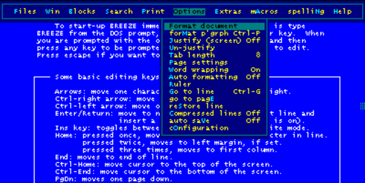
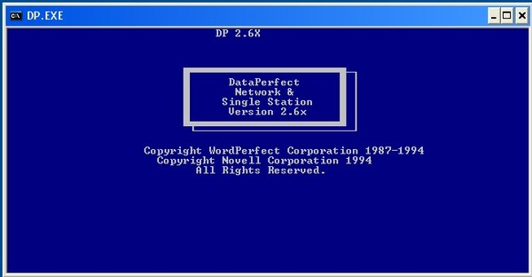
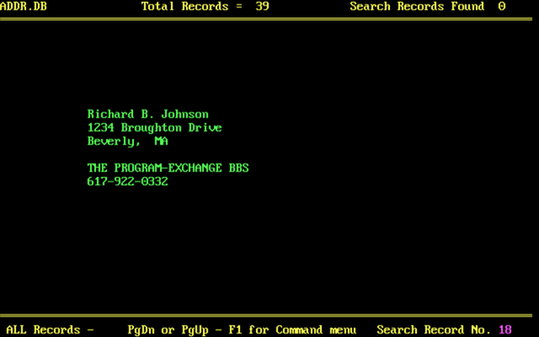
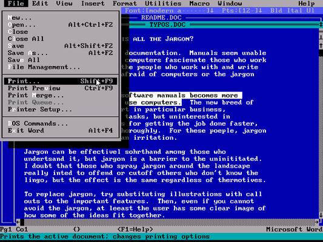
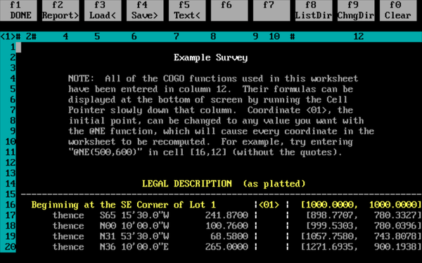
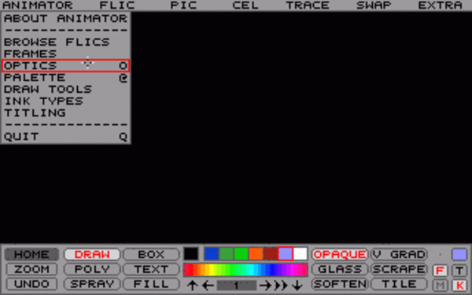
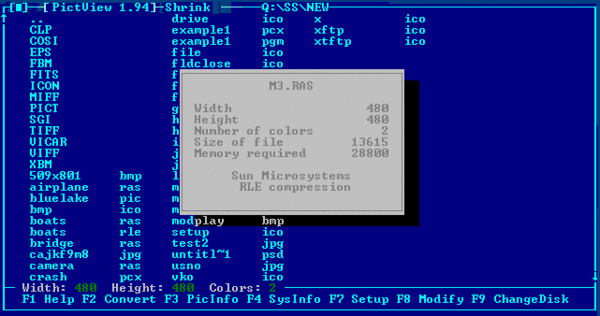
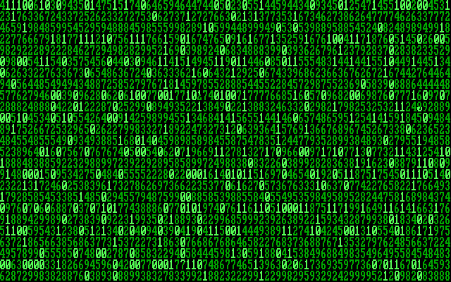
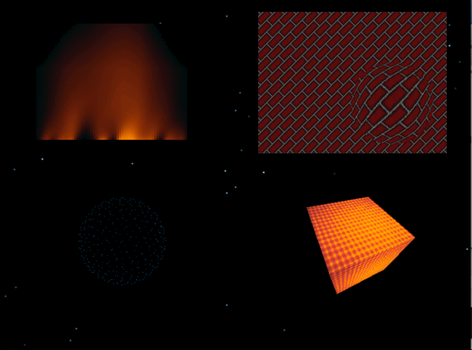
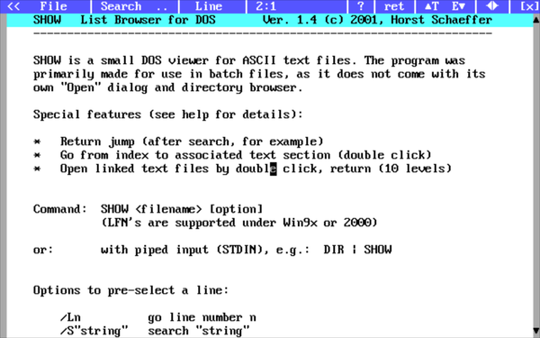

# freedos-repo

-----

## <a name="contents"></a>Contents
[Introduction](#Introduction)  
[Installation instructions](#Installation)  


[Program launchers, file managers and environments](#Launchers)  
[Productivity applications](#Productivity)  
[Graphics applications](#Graphics)  
[Programming languages etc.](#Development)  
[Games](#Games)  
[Eye Candy](#Eyecandy)  
[Command-line utilities](#Commandline)  
[Terminate-and-stay-resident utilities](#TSR)  
[Miscellaneous](#Misc)

[FreeDOS tips](#Tips)

-----

## <a name="Introduction"></a>Introduction

This is a repository of [FreeDOS](http://www.freedos.org/)-compatible freeware and OSS software. Not "abandonware", by which I mean that you will not find formerly commercial software here that have not been explicitly made open-source or at least freeware. 

However, non-crippled shareware with a single nag screen at the beginning or end is fair game. Whether you are going to try to send money to a developer from thirty or forty years ago who could be dead by now is up to you.

Having said that, there are a lot of little utilities from a kinder, gentler age, when people would just make their stuff available without worrying about licenses. These will be regarded as public domain until someone informs me otherwise.

Source code is included wherever possible.

This is not meant to be a conclusive collection of DOS applications. These are apps that I have tested on *FreeDOS 1.2* (on bare silicon and in the *DOSBox* emulator) and that I find useful, fun or interesting. If you need something more comprehensive, try [this site](http://reimagery.com/fsfd/) or [this one](https://www.opus.co.tt/dave/indexall.htm). I am not a gamer at all, so if that is what you are looking for, well, sorry, I only have a few of the simplest ones.

On a standard FreeDOS installation, Option 1 of the initial menu is
````
1 - Load FreeDOS with JEMMEX, no EMS (most UMBs), max RAM free
````
and that is the setting under which I test these programs. I have seen graphical programs, in particular, crash all too often under EMM386 in Option 2. If one of these apps absolutely requires Expanded Memory, I will document it here.

I may also slip in a few little apps that I wrote myself. You will know them by a certain primitive look and feel :-)

[Return to Table of Contents](#contents)

-----

## <a name="Installation"></a>To install these packages:

Download the package, transfer it to your FreeDOS system and extract the zip file to the **ROOT directory** (C:\\). 

    unzip packagename.zip -d c:\

You might be tempted to use the *DosZip Commander*, which is bundled with FreeDOS and can be called up with the command *dz*, or similar utilities. I advise against this. These packages were actually created under Linux and you may come across weird crc errors if you use *dz*. The command line works fine.

*It is important to extract these packages to the root directory!* This is different from official FreeDOS packages, wich expect to be extracted to *C:\FDOS*. There is an actual reason for this. Some of these very old programs are not relocatable: They have hardcoded paths inside them and will crash or refuse to load if you try to run them from a strange directory. I have tried really hard to stick to the FreeDOS file system and not litter your root with directories, but sometimes I simply can't. Better then, to have a single installation procedure for all my packages.

Programs that do not run directly from *c:\FDOS\BIN* will have a convenient batch file placed in *C:\FDOS\LINKS*. If a program requires changes to *CONFIG.SYS* or *AUTOEXEC.BAT*, that will be documented here. 

Sorry, there is no uninstall facility. But most of these packages consist of a single directory in C:\FDOS\PROGS (or C:\FDOS\DEVEL), a batch file in C:\FDOS\LINKS and an information file in C:\FDOS\APPINFO, so it shouldn't be too hard.

[Return to Table of Contents](#contents)

-----

## <a name="Launchers"></a>Program launchers, file managers and environments
+ <u>Access</u> (aka <u>XX</u>) - A menu program. It runs your applications and games.
    + Freeware by Ronald Blankendaal.
    + Access is especially suitable for people that are still using DOS, but do not endorse the command prompt and its limitations.
    + Access tries to overcome its most important annoyances. For example, in DOS, when a user wants to run a program, he or she would have to move to the appropriate directory on the disk first. Access will search for a program's location fully automatically.
    + Another important feature of Access is its simple user-friendly interface.
    + Straightforward, good-looking and customizable.
+ **Version 3.01**
    + This version is non-graphical and works fine on a 8088!
    + Packager's note: this is the one I use myself.
    + **Downloads:**
        + [English](./zip/xx3en.zip)
        + [Nederlands](./zip/xx3nl.zip)

  

+ **Version 4.60**
    + This is a complete rewrite and uses a graphical rather than a text interface.
    + It comes with a large collection of icons and Windows icons can be added with a standalone program.
    + **Downloads:**
        + [English](./zip/xx4en.zip)
        + [Nederlands](./zip/xx4nl.zip)


+ **Version 5.0**
    + Packager's note: Pre-release versions of Access v5 exist. I find them too buggy to package, but if you want to try, it can be downloaded at [http://members.quicknet.nl/blankendaalr/](http://members.quicknet.nl/blankendaalr/)
+ The following features are shared by all Access versions.
    + Takes no memory while running programs! No matter whether you start a program directly from DOS or from within Access, you will have exactly the same amount of conventional memory left.
    + Can store an unlimited number or programs and program groups, only limited by the amount of available free memory.
    + Has full mouse support.
    + Has an advanced feature called 'QuickKey' that can help you search for a program in the menu.
    + Supports both English and Dutch (Nederlands) in full.

+ [LCARS24](./zip/LCARS24.zip) - Emulates the look and feel of a certain well-known science fiction computer system.
    + Get your sound card working before you install this.
    + Originally from [SourceForge](https://sourceforge.net/projects/lcars24/).
    + GPL v2, source included.


[Return to Table of Contents](#contents)

-----

## <a name="Productivity"></a>Productivity applications

+ [ABBREVV](./zip/abbrevv.zip) - A  menu-oriented DOS application to view and maintain a  list  of
abbrevations.
    + Freeware by J R Ferguson for non-commercial purposes.
    + Acronyms may be up to 7 characters long, the description can be any text up to 69 characters.
    + It shows one or more sorted abbrevation lists, allows you to insert, change or delete entries and search for duplicates. 
    + You can also merge two or more abbrevation lists into  a  single  one.
    + The  program  interface  is  quite
intuitive,   offering  mouse  support,  Windows-like menus  and  multiple document subwindows.
    + The program saves its last used settings in a file named ABBREVV.SET, so it can automatically open the same abbrevation file windows the next time you start it.


+ [Acrobat Reader](./zip/acrodos.zip) - The one and only time Adobe, Inc made a PDF viewer for DOS.
    + I have taken care of the installation for you and "registered" it to "FreeDOS User".
    + You can start the program with either *acrodos* or *acrobat*: the two batch files are identical.
    + If you have graphical problems, try *acrodosu* or *acrobatu*: these load the UNIVBE driver before running Acrobat itself. Makes no difference on *my* system, but it might help with really old display cards.
    + Acrobat for DOS can only display PDFs built to an early specification. But there are ways to convert a modern PDF to an older version: see [here](https://www.techwalla.com/articles/how-to-convert-pdf-files-to-an-older-format) and [here](https://itstillworks.com/save-pdf-older-version-adobe-6781219.html) for some ideas on the subject. Or you can use [DOSPDF](#dospdf).
    + in *CONFIG.SYS*, your *FILES=* statement should be at least 20. The FreeDOS default is 40, so that should not be a problem.


+ [AS-EASY-AS](./imgs/aseasy.zip) 5.7 - Spreadsheet
    + In its day, this was THE shareware competitor to Lotus 1-2-3.
    + Now freeware courtesy of Trius, Inc.
    + Packaged as registered to "FreeDOS User" with serial number already filled in (but see the LSM file if you need it for some reason).
    + Also contains the manual in PDF format.


+ [Breeze](./zip/breeze.zip) by Kevin Solway - Perhaps the most comprehensive text editor ever written for DOS.
    + Ignore all the shareware documentation: according to the [website](http://www.theabsolute.net/sware/oldfav.html) this is now freeware.



+ [DataPerfect](./zip/datapfct.zip) 2.6 - A relational database.
    + DataPerfect, originally published by WordPerfect Corp, and later by Novell, was a fast, memory efficient, but capable relational database for DOS. 
    + WordPerfect Corp sold the product alongside their other DOS based office products, such as WordPerfect and PlanPerfect.
    + In 1995 Novell released DataPerfect as freeware and development was continued by its original author, Lew Bastian until about 2008.
    + **Packager's note:** I'll admit, I can't make head or tails of this program, but there are people who swear by it. You can get supporting programs and files [here](https://www.dataperfect.nl/files/).



+ [Freebase](./zip/freebase.zip) 1.2 - A free form flat-file database program.
    + Free form data entry using any ASCII text editor.
    + Rapid search and unlimited narrowing of the search records by subsequent searches using case insensitive search strings.
    + Ability to print search records.
    + Ability to write search records to a disk file.
    + Keywords to link records.



+ <u>Microsoft Word</u> 5.5 - The last version for DOS of Microsoft's all-conquering word processor.
    + Released as freeware by Microsoft, Inc, supposedly as a Y2K update, but it contains the entire program.
    + Word for DOS 5.x is a dual mode MS-DOS and OS/2 application. It supports operation under 16-bit OS/2 1.x console mode.
    + Version 5.5 changes the user interface. It adds Mac/Windows features like pulldown menus and overlapping windows.
    + Packages include standalone format translators - Word<->DCA, RTF<->DCA, DOS<->Word, & more. 
    + The UK English version has the largest selection of printer drivers.
    + You can install all four if you like - they won't clash. Start the one you want with the command WORD55XX where XX is one of UK, US, DE or FR.
    + As delivered, this package has drivers for VGA and a Hewlett-Packard LaserJet printer.
    + To change these, go to the SETUP directory and run SETUP.EXE.
    + When you get to the point where it asks if you want to setup a new WORD or change an existing one, choose the second option and then in the next screen give the directory name as c:\FDOS\PROGS\WORD55XX where XX is one of UK, US, DE or FR.
    + You can also change the initial display mode (default: text-mode) in the same way.
    + Downloads:
        + [UK English](./zip/word55uk.zip)
        + [US English](./zip/word55us.zip)
        + [Deutsch](./zip/word55de.zip)
        + [Français](./zip/word55fr.zip)



+ [PC Word](./zip/pcword.zip) 1.90: A fast, compact, flexible text processor
    + Uses HyperText functions to facilitate links for Table of Contents and Index, with automatic page numbering.
    + Freeware by Andrew Sprott.
    + Also includes RSORT, a text file sorting utility based on the sorting functions inPcWord
    + RSORT is self explained and is ready to run. Source code is included.


+ [Rebel](./zip/rebel.zip) - character mode spreadsheet without mouse support.
    + REBEL 3.x has been developed to satisfy the demand for a spreadsheet that offers unlimited customization potential.
    + The entire spreadsheet is patterned after a high level programming language.
    + By adding new functions and utilities, it can be tailored to fit the needs of virtually any user group. 
    + Freeware by Brad L. Smith



[Return to Table of Contents](#contents)

-----

## <a name="Graphics"></a> Graphics applications

+ [Animator](./zip/animator.zip) - (AKA Autodesk Animator, Video Paint, or simply V) is a 256 color paint and animation package.
    + BSD licensed.
    + See the [Home page](http://animatorpro.org) and the GitHub [code repository](https://github.com/AnimatorPro/Animator-Pro). 



+ [GrafX2](./zip/grafx2.zip) 2.0 beta 96.5%. - 256-colour bitmap editor.
    + Released as shareware, but the source was [GPL'ed a year later](https://web.archive.org/web/20071213221524/http://code.google.com/p/grafx2/wiki/FreeSoftwareRelease).
    + Lots of hotkeys, all reconfigurable with GFXCFG.EXE.
    + The batch file \FDOS\LINKS\GRAFX2.BAT defaults to a resolution that works well with my 1024X600 laptop screen. If that does not work for you, run GRFX2 /? from the program directory and change the "32" on the last line of the batch file to something that does.
    + You can also change the resolution inside the program. If you hit an unsupported resolution and get a screen full of gibberish, SHIFT-ENTER gets you back to a safe default.


+ [MVP Paint](./zip/mvppaint.zip) - Graphics editor.
    + Shareware by MVP Software
    + MVP Paint is a full-featured graphics workshop.
    + With MVP Paint you can easily create or modify graphics or animation files. 
    + It supports a variety of advanced features, and has been used to develop two MVP Software games, Sand Storm and Corncob 3D.
    + Originally created as an in-house game development tool, it has been tested extensively in real-world applications.


+ [PictView](./zip/pictview.zip)1.94 - A mouse-driven viewer and converter of images.
    + It runs on all EGA, VGA,  SuperVGA and  Extended VGA  video  adapters.
    + PictView is able to read images  stored in approximately  40 graphics file formats and convert them into  another format.
    + It can also resize images and change the colour depth.
    + Freeware by [Jan Patera](http://www.pictview.com).



[Return to Table of Contents](#contents)

-----

## <a name="Development"></a>Programming languages etc.

+ [Agena](./zip/agena.zip) 2.12.2 - an interpreted procedural programming language.
    + Dual-licensed GPL v2 and MIT
    + A new easy-to-learn procedural programming language.
    + Suitable for scientific, mathematical, scripting, networking, and many other applications.
    + Binaries are [available](https://sourceforge.net/projects/agena/) for Solaris, Windows, Linux, OS/2, Mac OS X, Raspberry Pi and DOS.
    + Source included.
    + Under active development, so keep an eye out for updates.
+ [Alice](./zip/alice.zip) - an IDE for the Alice dialect of Pascal, with a runtime interpreter.
    + Freeware by Brad Templeton.
    + This package contains all the tutorials and manuals mentioned on the [website](https://www.templetons.com/brad/alice.html), a review of the Atari ST version, and a Russian translation of the website.
    + The package defaults to the "large" version of Alice, which can use 640K of memory. The "regular" version is still there if you need it, but really, how many people are now working on a 256K system?


+ [Moonrock](./zip/moonrock.com) 0.5 - A BASIC-like language with several extensions.
    + Produces small and tight executables. 
    + 8086, 80186+ or 80386+ code.
    + DOS real mode or DPMI protected mode.
    + Includes compiler, ArrowSoft assembler, documentation and sample programs.
    + Freeware by Rowan Crowe.

[Return to Table of Contents](#contents)

-----

## <a name="Games"></a>Games

+ [ShuffleV](./zip/shufflev.zip) 1.1 - Tile shuffling game.
    + Freeware for non-commercial purposes by J R Ferguson.
    + Click a number joining the empty field to shift it, or use the cursor keys.
    + Order  the numbers from low to high, in rows left to right and columns top to bottom. The empty field must be in the lower-right corner.


+ [Towers of Hani](./zip/hanoi.zip) 1.3 
    + Freeware by J R Ferguson
    + A classical recursive algorithm for which a  'legend'  was thought  up.  In Hanoi there would be monks that have a sheer inhuman task: Nine stone disks, all with a different diameter and a hole in  the  middle, are  piled on a pole, the smallest op top. Two more poles are placed beside it. The task consists  of  moving  all  disks  from  the  leftmost  to  the rightmost pole, using the middle pole as a place to store disks in-between.
    + There are two rules that must be observed:
        + Only one disk can be moved at a time.
        + Never place a disk on top of one that is smaller.
    + According to the legend, the world will be at end when this task is done.


[Return to Table of Contents](#contents)

-----

## <a name="Eyecandy"></a>Eye Candy

+ [Acid Warp 4.2](./zip/acidwarp.zip) - Run it and watch the pretty colors.
    + Free Software by [Noah Spurrier](http://www.noah.org/acidwarp/).
    + *CTRL-Break* exits the program, If your keyboard does not have a *Break* key, *CTRL-C* also works ... eventually. You may have to hit it a few times.
    + Source code included, but it is marked as "private proprietary source code" (see *ACIDWARP.C*), so I guess that is for inspiration only.


+ [DeciMatrix](./zip/dcmatrix.zip) - Matrix-like screensaver.
    +  © [Bruno Félix Rezende Ribeiro](https://oitofelix.github.io), released under GNU GPL v3.
    + DeciMatrix is a program designed to decode the Matrix into decimal.
    + It works with CGA, EGA and VGA graphic adapters and it runs on any IBM-PC compatible, the minimum requirement being an 8086 processor with 16Kb of RAM.
    + It is based on the premise that it’s easier for people to become proficient in interpreting the Matrix code if instead of dealing with very cryptic symbols rolling down in the screen, they could deal with static and familiar symbols.
    + It’s still quite hard to learn how to see through the code, though; but don’t worry — if you happen to never see the woman in red, at least you’ll have used a very cool DOS screen-saver.
    + **Packager's note**: DCMATRIX does not clean up the screen mode after it closes, so you may want to issue a MODE CO80 afterwards.



+ [The Stary's screensavers](./zip/strss.zip) - A collection of five screensavers in EXE format.
    + BULGE, DOTTY, FLAMES, FURNACE and STRFIELD. 
    + Can also be used in DOS NAVIGATOR: see the documentation.
    + Freeware by Wojciech Dzierzanowski.



[Return to Table of Contents](#contents)

-----

## <a name="Commandline"></a>Command-line utilities

Most of these will end up in C:\FDOS\BIN. **Please note** that there are only so many filenames available when you have just eight characters to play with. You may already have a utility with the same name. If UNZIP asks whether to overwrite a file, think very carefully whether you want to use this file rather than the default FreeDOS one. I have tried to weed them out, but I may have missed some, and future versions of FreeDOS will no doubt contain more UNIX CLI ports.

+ [ANTIWORD](./zip/antiword.zip) - Extract text and (hopefully) images from a Microsoft Word .doc (not .docx) file.
    + GNU GPL v2 licensed.
+ [BELIEF](./zip/belief.zip) - generate random religious beliefs.
    + Public Domain sofware (as far as could be ascertained) with additional data by Michel Clasquin-Johnson. See also [this page](https://clasqm.github.io/Belief/).
    + Compiled with *BCC* under *FreeDOS* 1.2
    + *Example output:*
````
The Arian Theosophist Sect suspects that Darwin's "Origin of Species"
if read backwards, reveals cryptic messages from the last practicing
medicine man of the Mohicans, and says that only the faithful will
achieve reincarnation.
````
+ [BFIND](./zip/bfind.zip) - Enhanced FIND command.
    + The BFIND.EXE program adds Boolean logic to DOS's FIND command.
    + Freeware for personal use by Bruce Guthrie.
    + See the LSM file for instructions.

+ [BLRMU](./zip/blrmu.zip) v22 - Bud L Rasmussen's Mini Utilities.
    + Freeware / Public Domain.
    + For more extensive descriptions of these utilities, see the appropriate .doc file for any specific utility.
    + Miscellaneous utilities
        + BCR - Batch Carriage Return
        + BEEP7 - Beep 7 times
        + BEEPN - Beep n times
        + BUK - Beep Until Keypress
        + CCC - Color Change Command
        + CLR - Clear the screen to color at x=0, y=0
        + CRSR - Cursor control
        + CRST - Cursor Reset
        + DAFEM - Display Available, Free, Extended Memory
        + DFM - Display Free Memory
        + DIV - Display Interrupt Vectors
        + DIVOP - Display Interrupt Vectors On Printer
        + FD - Find Directory
        + FF - Form Feed
        + GO - Go to drive + directory
        + JD - Jump Directory
        + LFD - Label Floppy Disk
        + PBM - Put Batch Message
        + PRT - Print multiple copies of text files
        + TO - change TO drive + directory
        + TONL - Turn Off Num Lock
        + TRAD - Typematic Rate And Delay
    + Tune playing utilities
        + BIRDCALL - Play 'Birds' call (intro to 'Parkers Mood')
        + ITAINT - Play 'It Aint Necessarily So'
        + KCBLUZ - Play 'KC Blues'
        + NEWBLUZ - Play 'New Blues'
        + OLDBLUZ - Play 'Old Blues'
        + RITES - Play intro to "Rites of Spring'
    + Screen color change utilities
        + BLUWHT - Clear screen to white on blue
        + BLUYLO - Clear screen to yellow on blue
        + BRNWHT - Clear screen to white on brown
        + BRNYLO - Clear screen to yellow on brown
        + CYNWHT - Clear screen to white on cyan
        + CYNYLO - Clear screen to yellow on cyan
        + GRNWHT - Clear screen to white on green
        + GRNYLO - Clear screen to yellow on green
        + MAGWHT - Clear screen to white on magenta
        + MAGYLO - Clear screen to yellow on magenta
        + REDWHT - Clear screen to wht on red
        + REDYLO - Clear screen to yellow on red
        + WHTBLK - Clear screen to black on white

+ [BLRUT](./zip/blrut.zip) - *Bud L Rasmussen's Utilities* 
    + 28 general purpose DOS utilities.
        + BD -- Backup Directory
        + BHD -- Backup Hard Disk
        + BLF -- Backup Large File
        + BLRUT -- Executable form of BLRUT55.DOC
        + CACF -- Copy And Convert File
        + CF -- Copy File
        + DBPB -- Display BIOS Parameter Block
        + DCM -- Directory Copy/Move
        + DDBT -- Display Disk Base Table
        + DKV -- Display Key Value
        + DPT -- Display Partition Table
        + DSE -- Disk Sector Edit
        + EADF -- Erase All Diskette Files
        + EBU -- Execute BLR Utilities (menu/shell)
        + FCM -- File Copy/Move
        + FFD -- Format Floppy Diskette
        + FRE -- File Record Edit
        + LPAF -- List/Print Any File
        + LPD -- List/Print Directory
        + LPS -- List/Print Sector
        + LPTF -- List/Print Text File
        + LTF -- List Text File
        + PSF -- Print Spooled File
        + QDL -- Quick Directory List
        + RLF -- Restore Large File
        + RSD -- Rename Sub Directory
        + SD -- Space Display
        + SLTF -- Split Large Text Files
        + TFC -- Two File Compare
        + VLCC -- Volume Label Change, Compare
+ [CHANGE](./zip/change.zip) - Find-and-replace from the command line.
    + Processes change commands in files.
    + Files can be of any size and type (binary or text) and are processed quickly.
    + Up to thirty change commands can be processed in a single pass.
    + Also provides ability to remove trailing spaces from text files.
    + Freeware by [Bruce Guthrie](bguthrie@doc.gov) / U.S. Dept of Commerce.

+ <a name="dospdf"></a>[DOSPDF](./zip/dospdf.zip) - PDF viewer.
    + An outragous hack by [Mateusz Viste "Fox"](http://mateusz.viste.free.fr/dos).
    + This crashes my DOSBox, but works (slowly!) on a real FreeDOS install.
    + Use it when the old Acrobat for DOS chokes on a modern PDF.
    + Requires the *CDD* command - everything else is included, even a working installation of Alladdin Ghostscript.
    + I've done the SETUP already and copied the resulting batch file into /FDOS/BIN, so it should be ready to run.

+ [Figlet](./zip/figlet.zip) - A program that creates large characters out of ordinary screen characters.


+ [GUTREAD](./zip/gutread.zip) -  read texts from the Gutenberg Project (or any other text file) and remove all the newlines saving hours of editing in your word processor.
    + It will also produce the text in XML format.
    + See the LSM file for instructions.
    + Another utility that does the same thing is [WPPREP](./zip/wpprep.zip) by Les Leist.

+ [OZPACK](./zip/ozpack.zip) 1.3 - Great Australian utilities.
    + Shareware by Kevin Solway (other programs by Solway on this page have been explicitly declared to be freeware. This one has not).
    + I have removed MOVE, since it is already in FreeDOS.
        + ASCII - Simple ascii table displaying the decimal and hexadecimal equivalents of all ascii characters.
        + BEAUTIFY - Beautify thine writing! (complete with sexist language).
        + BIGTYPE - Create large and fancy lettering using only ascii graphic characters.
        + CMOS - Saves and restores the CMOS information on AT type computers (286 and above). 
        + CONVERT - Convert Wordstar format files to standard Ascii, Ascii to Wordstar, and Wordperfect format files to standard Ascii
        + ECALC - CLI inline calculator.
        + EXEMENU - Makes a menu (sorted alphabetically) out of the .EXE files (other than itself) found in same directory as itself.
        + FILEFIND - Finds all files matching a search pattern over a whole disk drive, and optionally moves to the directory of the located file.
        + FINDIN - Search for a string of characters within a standard text file and return with a DOS errorlevel value indicating whether the text has been found in the file.
        + FREE - This program gives a quick report of disk usage.
        + INFO - Provides basic system information, computer speed index and disk space information with diagram. 
        + INSTALL - Software installation with optional execution and uninstallation.
        + LIFE - This program models the processes of competition and selection in natural systems in a colourful graphic format. It will run in CGA mode on any CGA or EGA/VGA system.
        + LZEXE - Compressor for EXE files.
        + MAKECOM - Convert ordinary text files into self-displaying .COM files.
        + MYLIFE - Get a rough idea how many seconds you have left and see your life whittling away. 
        + PCAL - A simple picture calendar program.
        + PCXLIFE - Converts .PCX format graphics files into self-displaying executable programs that can be further compressed with the fabulous LZEXE. 
        + PEEPBO - A short and simple program to encrypt and decrypt files of any type.
        + POPCALC - Calculator.
        + PVIEW - A simple program for previewing the expected page layout when a plain ascii text file is printed.
        + QG - A small and fast program for drawing graphs on an EGA or VGA system.
        + QMEM - Provides a quick report on memory usage, including expanded memory usage. 
        + SEEVIRUS - This program displays the first sector of the selected disk drive. Its primary purpose is to check for viruses that infect the boot sector.
        + SLOWTO - This TSR program provides a convenient way to slow down your computer when the need arises. 
        + STARS - Fly through stars on an EGA or VGA system. Travelling at PRODIGIOUS speed. 
        + STATES - This is a useful program for non-Americans, and perhaps even some Americans, when dealing with American state codes. 
        + TCAPTURE - A memory resident program that can capture text screen images - IN FULL COLOUR - from other programs.
        + TIMEIT - Program to time how long it takes to run other programs - with millisecond accuracy!
        + TITLE - Writes a message to the screen in big letters. Useful in batch files and to grab attention.
        + VGAFCAPT - Will capture the current VGA text font to a file. The file can then be used with the program VGATEXT (which loads VGA fonts into memory). You can use this program to build-up a library of fonts.
        + VGATEXT - This program will change the screen text font on VGA systems.
        + VIEWPCX - Program for displaying .PCX (PC Paintbrush format) pictures. 
        + VIEWSCR - Displays colour text screen images (with extension of .SCR) created by Text Paint or captured by the program TCAPTURE.

+ [OZWOZ](./zip/ozwoz.zip) - the OZWOZ Utilities.
    + A collection of 35 command-line utilities.
    + Freeware for personal, non-commercial use.
        + 3812PRN -- IBM 3812 Pageprinter driver.
        + ALARM -- TSR pop-up alarm clock.
        + CHANGE -- Change text in one or more files.   
        + CHECKTD -- Check current time and/or date and set errorlevel.
        + CLEARKEY -- Clear "n" keystrokes from the keyboard buffer.
        + CURSOR -- Set cursor shape and style.
        + ERRORLVL -- Set the DOS errorlevel (return code).
        + EXERCISE -- Exercise a local or network file system and show performance.
        + FF -- Find file/s and change to directory if required.
        + GETOID -- Return Novell Netware object ID for user, groups, etc.
        + LOCK -- Simple network single application lock.
        + LS -- List file directories with many many options.
        + MAIL -- Simple mail facility for Novell Netware with a delay send option.
        + MAKEMENU -- Self maintaining menu utility with no executing memory overhead.
        + NETTALK -- User talk/chat utility for Novell Netware.
        + PLAY -- Play music and write your own.
        + RESET -- Presses the reset button and/or CTRL+ALT+DEL.
        + SATTRIB -- Modify attributes including hidden, system and sub-directories.
        + SAVEDIR -- Save current directory to a self restoring batch file.
        + SAVEPATH -- Save current path setting to a self restoring batch file.
        + SAVESCR -- Save/restore current text screen contents and attributes.
        + SCOPY -- Copy, move, update, break, concatenate files. By name, date, etc.
        + SCRTYPE -- Return screen type in use. CGA, MCGA, HERC, VGA, EGA, MONO, etc.
        + SD -- Select directory via a menu. Goes well with MAKEMENU utility.
        + SDEL -- Delete files including hidden, protected, in sub-directories, etc.
        + SETVPINF -- Change default directory stored in Ventura Publisher's VP.INF file.
        + SHOWTD -- Show current time/date with many options including a clock.
        + SLEEP -- Sleep for specified period. Can set for keyboard to interrupt.
        + STUDY -- Study helper. Asks questions randomly & gives answers and scores.
        + STUFFKEY -- Stuff keys into the keyboard buffer. No overhead or TSR used.
        + STYPE -- Display files contents with many convert, filter, skip, options.
        + TESTFILE -- Test accessability of a file under many modes. Good network tool.
        + TPBEAUT -- Prepare Turbo Pascal 5.5 code for output to a printer.
        + TYPEBACK -- Type a text file line by line backwards. Good for listing logs.
        + TYPEDW4 -- Types the DisplayWrite 4 EBCDIC file specified.

+ [PEDIT](./zip/pedit.zip) 4.00 - Programming editor.
    + Similar to the FreeDOS EDIT program, but more powerful, and with many additional features for programmers.
    + It includes pop-up tables, column support, macro key, undo, copy & paste to Windows applications, long filenames, word wrap, spell checker & thesaurus (English only, as far as I can make out), HTML support, and much more.
    + Freeware by Goldshell Digital Media.
    + In the Pedit package there's a file called PEDITLGT.EXE. This is the Light version of Pedit.  It's Pedit stripped of several options.
    + The purpose for this is to offer an editor which can easily be included on rescue floppies and such.
    + The omitted options are:
        + Spell checker.
        + Thesaurus.
        + Printing through Windows.
    + The remaining functionality is the same.
    + Also includes INSPECT, a hex editor.

+ [RUTILS](./zip/rutils.zip) v4 - Ricki's little useful (?) DOS utilities is a collection of mainly UNIX-workalike CLI commands.
    + Freeware by Richard Breuer.
    + I have removed CAL and HEAD since they are already in FreeDOS.
        + ASET - Enhanced SET command
        + BANNER - Display strings in huge letters.
        + CAT - Append several outputs to stdout.
        + CHMOD - Change the attributes of files.
        + CUT - Remove selected fields from each line of a file.
        + DCALC - Date Calculations.
        + DCAT - Disk Catalogue maker.
        + DETAB - Change tabs to spaces in several files.
        + ENTAB - Change spaces to tabs in several files.
        + FILE - File type guesser.
        + FMT - ASCII text formatter.
        + GENOUT - Generate program fragments for textual output.
        + HD - Display hex dumps of several files
        + L - Display information about files and directories
        + LOCASE - Change chars in several files from upper to lower case.
        + MCOL - Arrange text in multiple columns.
        + NCONV - Number conversion utility.
        + NODUP - Remove successive equal lines from files.
        + STRINGS - Find printable strings in an object file or binary.
        + TAIL - Show the last lines of a file.
        + UPCASE - Change chars in several files from lower to upper case.
        + WC - Count words, lines, and chars of several text files.

+ [SHOW](./zip/show.zip) 1.4 -  Text file Viewer.
    + Freeware by Horst Schaeffer.
    + SHOW is a small DOS viewer for ASCII text files.
    + The program was primarily made for use in batch files, as it does not come with its own "Open" dialog and directory browser.
    + See the LSM file for instructions.



+ <a name="viewht"></a>[VIEWHT](./zip/viewht.zip) - Quickie HTML viewer and converter.
    + Freeware by Kevin Solway.
    + A very useful tool for viewing web documents off-line, with hypertext linking and colours.
    + You can also use this program to simply convert HTML documents to standard text files.
    + Uses XMS for large files.

[Return to Table of Contents](#contents)

-----

## <a name="TSR"></a>Terminate-and-stay-resident utilities

Not a priority, sorry. These things can crash your system mightlily if you invoke them while in the wrong screen mode.

Still, if and when I do find some that are sufficiently robust and useful, I will post them here.

[Return to Table of Contents](#contents)

-----

## <a name="Misc"></a>Miscellaneous

+ [BigText](./zip/bigtext.zip) by Kevin Solway- Create self-displaying illustrated books & manuals.
    + A suite of programs that turns ordinary text files into self-contained, self- displaying executable files capable of displaying full colour illustrations in body of the text.
    + This program is specifically designed to make self-displaying books, manuals, documents, and catalogues.
    + The difference between Bigtext and similar programs is that it can handle genuinely BIG volumes of text (up to 700kb or more) and that it creates a single, neat and convenient executable file.
    + Ignore all the shareware documentation: according to the [website](http://www.theabsolute.net/sware/oldfav.html) this is now freeware.


+ [Crossword Helper](./zip/wordfind.zip) - *WORDFIND* helps you solve crossword puzzles.
    + Freeware by Dale Harris.


+ [Probert](./zip/probert.zip) - Offline encyclopaedia.
    + This is the HTML format of the FREE Probert Encyclopaedia.
    + Simply unzip the contents to C:\ and point your browser (Dillo, Arachne) or viewer ([viewht](#viewht)) at \FDOS\DOCS\PROBERT\INDEX.HTM
    + Freeware by [Matthew Probert](probertm@pins.co.uk)


[Return to Table of Contents](#contents)

-----

## <a name="Tips"></a>FreeDOS Tips

These are just a few tricks that I figured out to make my life in FreeDOS a little easier.

**1. Fix the floppy drive blues.**

Who still has a computer with a floppy drive? But old DOS apps assume that it is there and will throw up error messages if you accidentally select that drive. Here's the fix:
````
MKDIR C:\FDOS\DRIVEA
MKDIR C:\FDOS\DRIVEB
````
Now include the following lines in your AUTOEXEC.BAT

````
SWSUBST A: C:\FDOS\DRIVEA
SWSUBST B: C:\FDOS\DRIVEB
````

[Return to Table of Contents](#contents)

-----
