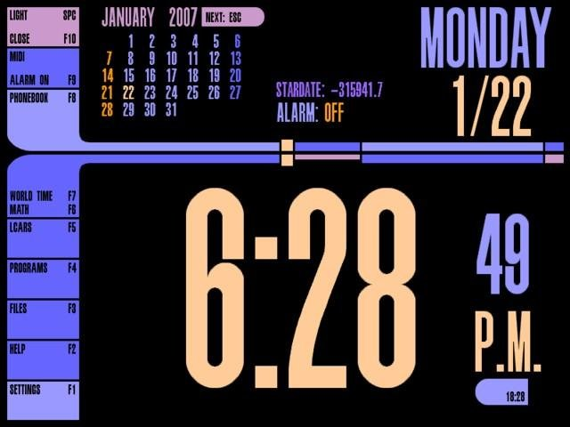
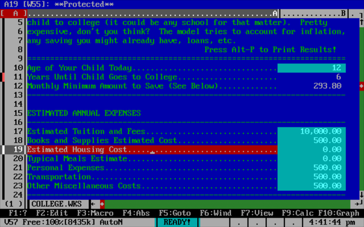
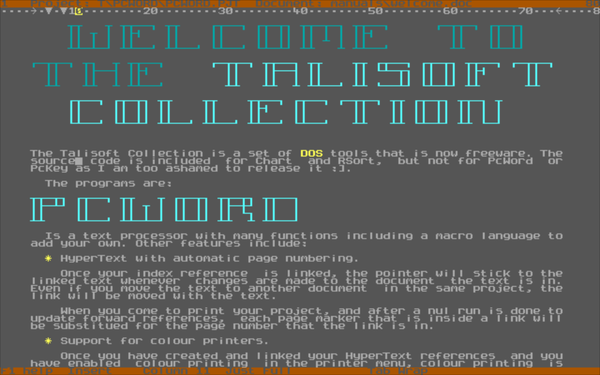
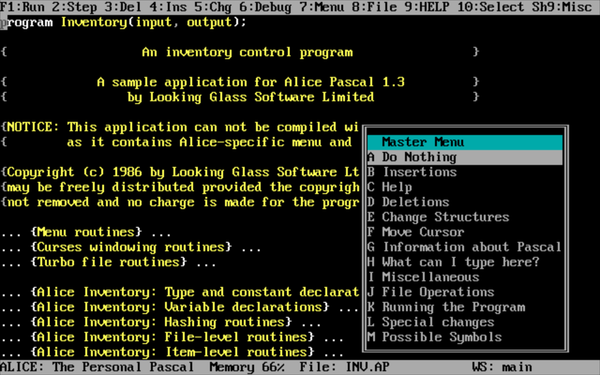

# freedos-repo

-----

## <a name="contents"></a>Contents
[Introduction](#Introduction)  
[Installation instructions](#Installation)  


[Program launchers and environments](#Launchers)  
[Productivity applications](#Productivity)  
[Graphics applications](#Graphics)  
[Programming languages etc.](#Development)  
[Eye Candy](#Eyecandy)  
[Command-line utilities](#Commandline)  
[Terminate-and-stay-resident utilities](#TSR)  
[Miscellaneous](#Misc)

[FreeDOS tips](#Tips)

-----

## <a name="Introduction"></a>Introduction

This is a repository of [FreeDOS](http://www.freedos.org/)-compatible freeware and OSS software. Not "abandonware", by which I mean that you will not find formerly commercial software here that have not been explicitly made open-source or at least freeware. 

However, non-crippled shareware with a single nag screen at the beginning or end is fair game. Whether you are going to try to send money to a developer from thirty or forty years ago who could be dead by now is up to you.

Having said that, there are a lot of little utilities from a kinder, gentler age, when people would just make their stuff available without worrying about licenses. These will be regarded as public domain until someone informs me otherwise.

Source code is included wherever possible.

This is not meant to be a conclusive collection of DOS applications. These are apps that I have tested on *FreeDOS 1.2* (on bare silicon and in the *DOSBox* emulator) and that I find useful or interesting. If you need something more comprehensive, try [this site](http://reimagery.com/fsfd/) or [this one](https://www.opus.co.tt/dave/indexall.htm). I am not a gamer at all, so if that is what you are looking for, well, sorry.

I may also slip in a few little apps that I wrote myself. You will know them by a certain primitive look and feel :-)

[Return to Table of Contents](#contents)

-----

## <a name="Installation"></a>To install these packages:

Download the package, transfer it to your FreeDOS system and extract the zip file to the **ROOT directory** (C:\\). 

    unzip packagename.zip -d c:\

You might be tempted to use the *DosZip Commander*, which is bundled with FreeDOS and can be called up with the command *dz*, or similar utilities. I advise against this. These packages were actually created under Linux and you may come across weird crc errors if you use *dz*. The command line works fine.

*It is important to extract these packages to the root directory!* This is different from official FreeDOS packages, wich expect to be extracted to *C:\FDOS*. There is an actual reason for this. Some of these very old programs are not relocatable: They have hardcoded paths inside them and will crash or refuse to load if you try to run them from a strange directory. I have tried really hard to stick to the FreeDOS file system and not litter your root with directories, but sometimes I simply can't. Better then, to have a single installation procedure for all my packages.

Programs that do not run directly from *c:\FDOS\BIN* will have a convenient batch file placed in *C:\FDOS\LINKS*. If a program requires changes to *CONFIG.SYS* or *AUTOEXEC.BAT*, that will be documented here. 

Sorry, there is no uninstall facility. But most of these packages consist of a single directory in C:\FDOS\PROGS (or C:\FDOS\DEVEL), a batch file in C:\FDOS\LINKS and an information file in C:\FDOS\APPINFO, so it shouldn't be too hard.

[Return to Table of Contents](#contents)

-----

## <a name="Launchers"></a>Program launchers and environments
+ [LCARS24](./zip/LCARS24.zip) - Emulates the look and feel of a certain well-known science fiction computer system.
    + Get your sound card working before you install this.
    + Originally from [SourceForge](https://sourceforge.net/projects/lcars24/).
    + GPL v2, source included.



[Return to Table of Contents](#contents)

-----

## <a name="Productivity"></a>Productivity applications

+ [ABBREVV](./zip/abbrevv.zip) - A  menu-oriented DOS application to view and maintain a  list  of
abbrevations.
    + Freeware by J R Ferguson for non-commercial purposes.
    + Acronyms may be up to 7 characters long, the description can be any text up to 69 characters.
    + It shows one or more sorted abbrevation lists, allows you to insert, change or delete entries and search for duplicates. 
    + You can also merge two or more abbrevation lists into  a  single  one.
    + The  program  interface  is  quite
intuitive,   offering  mouse  support,  Windows-like menus  and  multiple document subwindows.
    + The program saves its last used settings in a file named ABBREVV.SET, so it can automatically open the same abbrevation file windows the next time you start it.


+ [Acrobat Reader](./zip/acrodos.zip) - The one and only time Adobe, Inc made a PDF viewer for DOS.
    + I have taken care of the installation for you and "registered" it to "FreeDOS User".
    + You can start the program with either *acrodos* or *acrobat*: the two batch files are identical.
    + If you have graphical problems, try *acrodosu* or *acrobatu*: these load the UNIVBE driver before running Acrobat itself. Makes no difference on my system, but it might help with really old display cards.
    + Acrobat for DOS can only display PDFs built to an early specification. But there are ways to convert a modern PDF to an older version: see [here](https://www.techwalla.com/articles/how-to-convert-pdf-files-to-an-older-format) and [here](https://itstillworks.com/save-pdf-older-version-adobe-6781219.html) for some ideas on the subject.
    + in *CONFIG.SYS*, your *FILES=* statement should be at least 20. The FreeDOS default is 40, so that should not be a problem.


+ [AS-EASY-AS](./imgs/aseasy.zip) 5.7 - Spreadsheet
    + In its day, this was THE shareware competotor to Lotus 1-2-3.
    + Now freeware courtesy of Trius, Inc.
    + Packaged as registered to "FreeDOS User" with serial number already filled in (but see the LSM file if you need it for some reason).
    + Also contains the manual in PDF format.



+ [Breeze](./zip/breeze.zip) by Kevin Solway - Perhaps the most comprehensive text editor ever written for DOS.
    + Ignore all the shareware documentation: according to the [website](http://www.theabsolute.net/sware/oldfav.html) this is now freeware.


+ <u>Microsoft Word</u> 5.5 - The last version for DOS of Microsoft's all-conquering word processor.
    + Released as freeware by Microsoft, Inc, supposedly as a Y2K update, but it contains the entire program.
    + Word for DOS 5.x is a dual mode MS-DOS and OS/2 application. It supports operation under 16-bit OS/2 1.x console mode.
    + Version 5.5 changes the user interface. It adds Mac/Windows features like pulldown menus and overlapping windows.
    + Packages include standalone format translators - Word<->DCA, RTF<->DCA, DOS<->Word, & more. 
    + The UK English version has the largest selection of printer drivers.
    + You can install all four if you like - they won't clash. Start the one you want with the command WORD55XX where XX is one of UK, US, DE or FR.
    + As delivered, this package has drivers for VGA and a Hewlett-Packard LaserJet printer.
    + To change these, go to the SETUP directory and run SETUP.EXE.
    + When you get to the point where it asks if you want to setup a new WORD or change an existing one, choose the second option and then in the next screen give the directory name as c:\FDOS\PROGS\WORD55XX where XX is one of UK, US, DE or FR.
    + You can also change the initial display mode (default: text-mode) in the same way.
    + Downloads:
        + [UK English](./zip/word55uk.zip)
        + [US English](./zip/word55us.zip)
        + [Deutsch](./zip/word55de.zip)
        + [Français](./zip/word55fr.zip)


+ [PC Word](./zip/pcword.zip) 1.90: A fast, compact, flexible text processor
    + Uses HyperText functions to facilitate links for Table of Contents and Index, with automatic page numbering.
    + Freeware by Andrew Sprott.
    + Also includes RSORT, a text file sorting utility based on the sorting functions inPcWord
    + RSORT is self explained and is ready to run. Source code is included.



+ [Rebel](./zip/rebel.zip) - character mode spreadsheet without mouse support.
    + REBEL 3.x has been developed to satisfy the demand for a spreadsheet that offers unlimited customization potential.
    + The entire spreadsheet is patterned after a high level programming language.
    + By adding new functions and utilities, it can be tailored to fit the needs of virtually any user group. 
    + Freeware by Brad L. Smith


[Return to Table of Contents](#contents)

-----

## <a name="Graphics"></a> Graphics applications

+ [Animator](./zip/animator.zip) - (AKA Autodesk Animator, Video Paint, or simply V) is a 256 color paint and animation package.
    + BSD licensed.
    + See the [Home page](http://animatorpro.org) and the GitHub [code repository](https://github.com/AnimatorPro/Animator-Pro). 


[Return to Table of Contents](#contents)

-----

## <a name="Development"></a>Programming languages etc.

+ [Agena](./zip/agena.zip) 2.7.9 - an interpreted procedural programming language.
    + Dual-licensed GPL v2 and MIT
    + A new easy-to-learn procedural programming language.
    + Suitable for scientific, mathematical, scripting, networking, and many other applications.
    + Binaries are [available](https://sourceforge.net/projects/agena/) for Solaris, Windows, Linux, OS/2, Mac OS X, Raspberry Pi and DOS.
    + Source included.
    + Under active development, so keep an eye out for updates.
+ [Alice](./zip/alice.zip) - an IDE for the Alice dialect of Pascal, with a runtime interpreter.
    + Freeware by Brad Templeton.
    + This package contains all the tutorials and manuals mentioned on the [website](https://www.templetons.com/brad/alice.html), a review of the Atari ST version, and a Russian translation of the website.
    + The package defaults to the "large" version of Alice, which can use 640K of memory. The "regular" version is still there if you need it, but really, how many people are now working on a 256K system?



[Return to Table of Contents](#contents)

-----

## <a name="Eyecandy"></a>Eye Candy

+ [Acid Warp 4.2](./zip/acidwarp.zip) - Run it and watch the pretty colors.
    + Free Software by [Noah Spurrier](http://www.noah.org/acidwarp/).
    + *CTRL-Break* exits the program, If your keyboard does not have a *Break* key, *CTRL-C* also works ... eventually. You may have to hit it a few times.
    + Source code included, but it is marked as "private proprietary source code" (see *ACIDWARP.C*), so I guess that is for inspiration only.


[Return to Table of Contents](#contents)

-----

## <a name="Commandline"></a>Command-line utilities

+ [ANTIWORD](./zip/antiword.zip) - Extract text and (hopefully) images from a Microsoft Word .doc (not .docx) file.
    + GNU GPL v2 licensed.
+ [BELIEF](./zip/belief.zip) - generate random religious beliefs.
    + Public Domain sofware (as far as could be ascertained) with additional data by Michel Clasquin-Johnson. See also [this page](https://clasqm.github.io/Belief/).
    + Compiled with *BCC* under *FreeDOS* 1.2
    + *Example output:*
````
The Arian Theosophist Sect suspects that Darwin's "Origin of Species"
if read backwards, reveals cryptic messages from the last practicing
medicine man of the Mohicans, and says that only the faithful will
achieve reincarnation.
````
+ [BFIND](./zip/bfind.zip) - Enhanced FIND command.
    + The BFIND.EXE program adds Boolean logic to DOS's FIND command.
    + Freeware for personal use by Bruce Guthrie.
    + See the LSM file for instructions.

+ [DOSPDF](./zip/dospdf.zip) - PDF viewer.
    + An outragous hack by [Mateusz Viste "Fox"](http://mateusz.viste.free.fr/dos).
    + This crashes my DOSBox, but works (slowly!) on a real FreeDOS install.
    + Use it when the old Acrobat for DOS chokes on a modern PDF.
    + Requires the *CDD* command - everything else is included, even a working installation of Alladdin Ghostscript.
    + I've done the SETUP already and copied the resulting batch file into /FDOS/BIN, so it should be ready to run.

[Return to Table of Contents](#contents)

-----

## <a name="TSR"></a>Terminate-and-stay-resident utilities

Not a priority, sorry. These things can crash your system mightlily if you invoke them while in the wrong screen mode.

Still, if and when I do find some that are sufficiently robust and useful, I will post them here.

[Return to Table of Contents](#contents)

-----

## <a name="Misc"></a>Miscellaneous

+ [BigText](./zip/bigtext.zip) by Kevin Solway- Create self-displaying illustrated books & manuals.
    + A suite of programs that turns ordinary text files into self-contained, self- displaying executable files capable of displaying full colour illustrations in body of the text.
    + This program is specifically designed to make self-displaying books, manuals, documents, and catalogues.
    + The difference between Bigtext and similar programs is that it can handle genuinely BIG volumes of text (up to 700kb or more) and that it creates a single, neat and convenient executable file.
    + Ignore all the shareware documentation: according to the [website](http://www.theabsolute.net/sware/oldfav.html) this is now freeware.


+ [Crossword Helper](./zip/wordfind.zip) - *WORDFIND* helps you solve crossword puzzles.
    + Freeware by Dale Harris.


[Return to Table of Contents](#contents)

-----

## <a name="Tips"></a>FreeDOS Tips

These are just a few tricks that I figured out to make my life in FreeDOS a little easier.

**1. Fix the floppy drive blues.**

Who still has a computer with a floppy drive? But old DOS apps assume that it is there and will throw up error messages if you accidentally select that drive. Here's the fix:
````
MKDIR C:\FDOS\DRIVEA
MKDIR C:\FDOS\DRIVEB
````
Now include the following lines in your AUTOEXEC.BAT

````
SWSUBST A: C:\FDOS\DRIVEA
SWSUBST B: C:\FDOS\DRIVEB
````

[Return to Table of Contents](#contents)

-----
